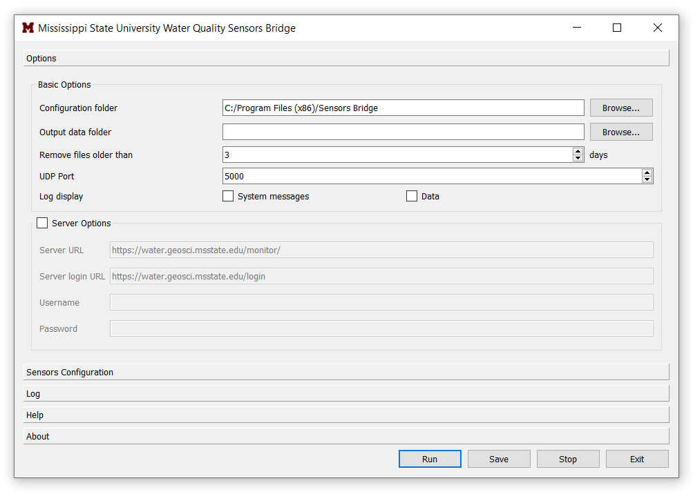

# Water Monitor Sensors Bridge

Sensors Bridge receives data from water quality sensors. It currently support Ecotriplets 1, 2, 
and 3, dissolved oxygen, and co2procv and any sensor sent via UDP such as GPS and water quality 
sensors. It saves data to a folder and sends it to a server. Sensors Bridge is developed under 
the U.S. Army Engineer Research and Development Center (ERDC) funded project coordinated by 
Mississippi State University Geosystems Research Institute. It is initially designed to read 
water quality sensor and ancillary data from MSU SeaTrac Autonomous Boat and send it to a 
receiving server and the [Water Monitor](https://water.geosci.msstate.edu/monitor/) web application. It is customizable to use for other 
sensors but this feature is not yet added. 

It is a free software under GNU General Public License 3.




## User Installation

- A Windows installer and a portable executable are located in `dist` folder of the repository.
- Install SensorsBridge using the installer SensorsBridgeInstaller_v1.0.0.exe
- You can run SensorsBridgePortable_v1.0.0.exe without installation   

## Sending to Server

The functionality of the original version has changed somewhat - the processes that handle serial/UDP
sensor reads now no longer try to connect to the server as well. That has been spun off to a different
function within the hardware. Setting the "Send Interval" parameter (in seconds) will specify how often
data should be sent. The function will send everything in the data folder that is a sensor CSV file.
Upon a failed run (lost network connection), the sensor's "_lastline.txt" file should contain the last
valid line sent, and will resume upon reestablished network link.

Functionally, this only uses one thread to send the data, so sensor data will come in serially (in the
order of specified sensors), as opposed to separate threads for each sensor. This will potentially be
changed to a thread per sensor as before, but for now remains untouched.

## Using Standalone Server Scripts

An addition to this code is the "send_data_files_tk.py" file. This separates the sending to the server
from the main software, and is primarily a temporary file to manage issues occurring when the network
is sporadic, leading to sensor reads dropping readings and not writing to the local data files. This
will eventually be rolled into the main code in a cleaner manner, but is added in this manner for
time-related purposes.

When using this script, the server sending in the main software should be *disabled*. This can be done
with the checkbox next to the server options, or edited within the configuration file.

## Developer Installation

- Install Python 3.6 

``` bash
# Install dependencies
pip install -r requirements.txt

```

Configuration
---
In config.json set:
- `data_path` to your preferred output location
- Change COM3, COM4, COM5, COM6, COM7 to their respective port in which they are connected to your computer.
- If you have data streamed through a UDP port, modify `udp_port`
---
If you would like to send data to your server, fill out the following:

- "server": "https://servername.org/somepath/"
- "server_login": "https://water.geosci.msstate.edu/monitoradmin/signin"
- "username": "someusername"
- "password": "somepassword"
- If you are not sending data to a server make sure to set `send_data` to `false`.

Using the Standalone Script
---
- Run run.py or double click `start_sensors_bridge.bat` file. It will start reading and saving data to the `data_path`.
- You can run the `main.py` script as a schedule task using `sensors_bridge_task.xml`.

Compiling the Executables and  Installer
---
The Installer and Portable versions are 
available in the `dis` folder of the 
repository. However, if you need to modify 
the code and rebuild the installer, the 
following steps needs to be followed. 
1. Modify `SensorsBridgeone.spec` and `SensorsBridge.spec` path `D:\\MSU\\watermonitor\\sensors_bridge` and 
`build/installer/installer_final.iss` path `D:\MSU\watermonitor\sensors_bridge` using any text editor
 a path where the repository is located in your computer.
1. Run `pyinstaller --clean SensorsBridgeone.spec` to build the portable version.
1. Run `pyinstaller --clean SensorsBridge.spec` to build the installable version.
1. Download and install Inno Setup to create a setup file for the installable version created in Step 2.
1. Open Inno Setup and Open the file `build/installer/installer_final.iss`
1. Click on Build > Compile to create the Setup file. It will save it to the `dist` folder of your repository.

## App Info

### Authors
- Wondimagegn Tesfaye Beshah
- Jane Moorhead
- Dr. Padmanava Dash
- Lee Hathcock

### Version
1.0.1

### License
[GNU General Public License Version 3](https://github.com/wondie/sensors_bridge/blob/master/LICENSE)
 
Copyright@ [Mississippi State University](https://www.msstate.edu/)
 
